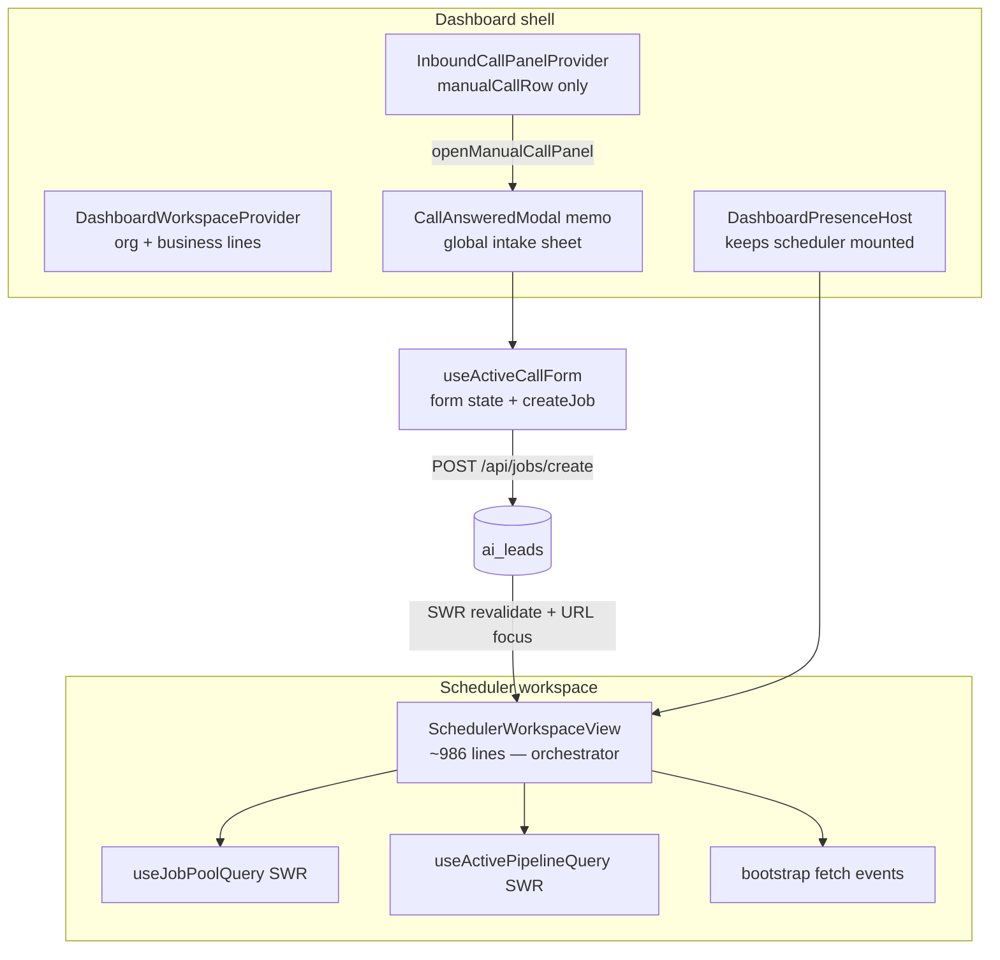
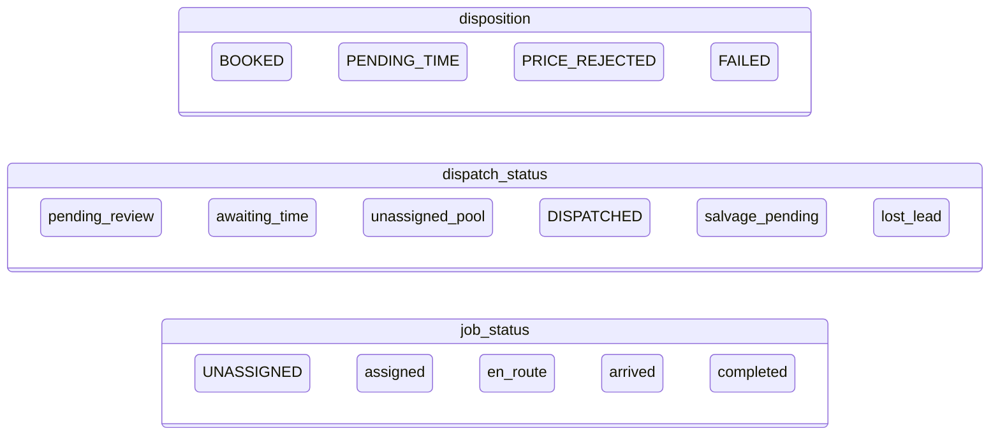

# Scheduler Workspace — Technical Spec Audit

**Date:** July 10, 2026  
**Scope:** `/dashboard/scheduler` and its supporting intake, pipeline, hopper, and data layers  
**Primary files:** `components/workspace-views/scheduler-workspace-view.tsx`, `components/scheduler/*`, `components/dashboard/CallAnsweredModal.tsx`, `lib/hooks/use-active-call-form.ts`, `lib/db.ts`, `scripts/074–076-scheduler*.sql`

---

## Executive summary

The scheduler workspace is a **hub-and-spoke orchestrator**: one large parent view merges three job feeds (calendar bootstrap, hopper SWR, active-pipeline SWR), while intake runs in a **globally mounted modal** decoupled from scheduler form state. That separation is good — typing in intake does **not** re-render the scheduler board per keystroke.

The main risks are **structural**: a ~1,000-line parent with undivided state, **triple data sources** that must be manually synced, **fragmented status lifecycles**, and **scheduler UI** that hardcodes `zinc`/`slate` Tailwind classes instead of the semantic tokens already defined in `app/globals.css`.

---

## 1. State management

### 1.1 Component architecture



| Layer | Mechanism | Owns | Scheduler impact |
|-------|-----------|------|------------------|
| `SchedulerWorkspaceView` | Local `useState` (~20 vars) | Calendar, drawers, highlights, bootstrap `events`, tombstones | Full tree re-render on any local state change |
| `useJobPoolQuery` | SWR + persisted cache | Hopper (`unassigned_pool`) | Parent re-render when `poolJobs` reference changes |
| `useActivePipelineQuery` | SWR + persisted cache | Active lane for `selectedDay` | Parent re-render when pipeline changes |
| Bootstrap `load()` | Manual `fetch` | Month `events`, technicians, tags | Not SWR — race-guarded via `loadSeqRef` |
| `InboundCallPanelContext` | React context | `manualCallRow` identity only | One re-render when panel opens/closes |
| `useActiveCallForm` | Hook inside modal | Entire intake `form` object | **Isolated** — scheduler does not subscribe |
| `JobDetailDrawer` | Local `useState` (~20 fields) | Edit form for existing jobs | Parent only updates on save/close |
| Pusher + `lyncr-workspace-data-changed` | Events | Cross-tab refresh | Full `refreshSchedulerData()` |

**Mounting behavior:** Scheduler is kept alive after first visit (`dashboard-presence-host.tsx`). `CallAnsweredModal` is a **sibling** of main content in `dashboard-shell.tsx`, not a child of the scheduler view.

---

### 1.2 Job data flow between surfaces

#### A. Intake → hopper → schedule

```
[+ New Intake] or answered Telnyx call
  → InboundCallPanelContext.openManualCallPanel() OR Pusher call-answered
  → CallAnsweredModal + useActiveCallForm
  → POST /api/jobs/create (lib/create-intake-job.ts)
  → notifyWorkspaceDataChanged + revalidateSchedulerJobPoolCaches()
  → router.push(/dashboard/scheduler?focus={leadId}&schedule=1)
  → SchedulerWorkspaceView URL effects open IntakeScheduleDialog
  → PATCH /api/owner/scheduler/[id] sets scheduled_at + tech
  → handleAppointmentCreated updates local events[] + SWR mutate
```

#### B. Hopper → swimlane

```
JobPoolPanel (displayPoolJobs)
  → drag / mobile assign / PoolScheduleDialog
  → POST /api/owner/jobs/pool/[id]/schedule
  → mutatePool + handleAppointmentCreated + mutateActivePipeline
```

#### C. Active pipeline lane

```
useActivePipelineQuery(orgId, pipelineDayKey)
  → ActivePipelinePanelStream → ActivePipelinePanel
  → edit → JobDetailDrawer (isolated form state)
  → mark complete → useMarkJobComplete → PATCH status
```

#### D. Triple feed sync problem

The scheduler merges **three independent job sources**:

| Feed | Source | Used for |
|------|--------|----------|
| `events[]` | `GET /api/owner/scheduler/bootstrap` | Swimlanes, calendar dots |
| `poolJobs` | SWR `GET /api/owner/jobs/pool` | Hopper panel |
| `activePipelineJobs` | SWR `GET /api/owner/jobs/pool?scope=active&day=…` | Pipeline lane |

`applyJobEventUpdate`, delete handlers, and Pusher listeners must manually keep all three in sync. `deletedJobIds` (session tombstone `Set`) guards stale bootstrap/SWR races.

---

### 1.3 Re-render analysis: does typing in an edit form re-render the parent?

| Surface | Typing re-renders scheduler parent? | Notes |
|---------|-------------------------------------|-------|
| **CallAnsweredModal intake** | **No** | `form` lives in `useActiveCallForm`; context only holds `manualCallRow` |
| **JobDetailDrawer** | **No** | ~20 local `useState` fields; parent props unchanged per keystroke |
| **IntakeScheduleDialog** | **No** | Local date/time/tech state |
| **SchedulerWorkspaceView itself** | **Yes** | Any `highlightId`, drawer, or saving flag change re-renders full tree |

#### Intake-side costs (modal only, not scheduler)

`use-active-call-form.ts` runs debounced side effects keyed on the **entire `form` object**:

| Effect | Debounce | Dependency concern |
|--------|----------|-------------------|
| Customer auto-save PUT | 1s | `[callLogId, current, form, resolvedPhoneNumber]` — any field change retriggers timer |
| Customer lookup | 350ms | Phone + name |
| Address geocode | 400ms | Address fields |
| Draft localStorage | 350ms | Full `form` in `CallAnsweredModal` |

**Verdict:** No unnecessary **parent** re-renders from intake typing. The modal itself re-renders on every keystroke (expected). Customer PUT effect could be narrowed to stable field slices to reduce work inside the modal.

#### Scheduler-internal re-render risks

1. **Monolithic parent** — `SchedulerWorkspaceView` has no `React.memo` boundaries; `TechnicianSwimlaneBoard` is not memoized.
2. **Unstable callbacks** — `openPoolJobDrawer`, `highlightPipelineJob`, `editPipelineJob` recreated each render (lines ~211–247).
3. **Live clock** — `useLiveClock` (30s tick) inside `ActivePipelinePanel` and `SchedulerDispatchLiveStatus` (memoized) — localized, does not tick the parent.
4. **SWR mutations** — Expected full refresh when hopper/pipeline data changes.

---

### 1.4 Intake modal inventory

| Modal / sheet | File | Wired to scheduler? | State model |
|---------------|------|---------------------|-------------|
| `CallAnsweredModal` | `components/dashboard/CallAnsweredModal.tsx` | Yes — global, opens from scheduler + Pusher | `useActiveCallForm` + workflow `currentStep` |
| `IntakeScheduleDialog` | `components/scheduler/intake-schedule-dialog.tsx` | Yes — post-create URL `schedule=1` | Local form → PATCH scheduler |
| `JobDetailDrawer` | `components/scheduler/job-detail-drawer.tsx` | Yes — pool/pipeline/swimlane | Isolated local state |
| `PoolScheduleDialog` | `components/scheduler/pool-schedule-dialog.tsx` | Yes — hopper drag | Local state |
| `SchedulerBookingDialog` | `components/scheduler-booking-dialog.tsx` | **No — unused in live view** | Documented in `docs/SCHEDULER-AND-NOTEPAD.md` but empty-slot booking calls `openManualCallPanel()` instead |

---

## 2. UI consistencies (Tailwind / dark mode)

### 2.1 Design system baseline

`app/globals.css` defines a unified dark theme via CSS variables **and** scheduler-specific `@layer components` classes (`.scheduler-glass-card`, `.scheduler-interactive-card`, `.scheduler-metadata-label`, `.scheduler-field-stack`, `.scheduler-input-focus`).

Canonical TypeScript tokens live in **`lib/scheduler-ui-tokens.ts`** — import these in scheduler components instead of duplicating class strings.

| Token | Purpose |
|-------|---------|
| `--background`, `--foreground` | Page base |
| `--card`, `--muted`, `--secondary` | Surfaces |
| `--border`, `--input` | Borders and inputs |
| `--primary` | Electric cyan accent (`oklch`) |
| `--surface` | Elevated panels |
| `--shell-header-h`, `--shell-dock-h` | Mobile shell math (`lib/mobile-shell.ts`) |

Tailwind maps these to `bg-background`, `bg-card`, `bg-muted`, `border-border`, `text-foreground`, etc.

### 2.2 Scheduler divergence: hardcoded zinc/slate

A scan of `components/scheduler/**` shows **systematic use of raw palette classes** instead of semantic tokens:

| Pattern | Approx. occurrences (scheduler/) | Example files |
|---------|----------------------------------|---------------|
| `bg-zinc-*` | ~40+ | `scheduler-mobile-dispatch-shell.tsx`, `active-pipeline-panel.tsx`, `job-edit-workflow.tsx` |
| `border-zinc-*` / `text-zinc-*` | ~50+ | `dispatch-operations-metric-strip.tsx`, `technician-swimlane-board.tsx` |
| `bg-slate-*` | ~10 (mixed with zinc) | `job-detail-overview.tsx`, `CallAnsweredModal.tsx` footer |
| Semantic `bg-card` / `border-border` | ~35 (partial adoption) | `technician-swimlane-board.tsx`, `intake-schedule-dialog.tsx` |

**Representative duplicates:**

```tsx
// Three different "dark panel" recipes in scheduler alone:
"border-zinc-800 bg-zinc-950/40"           // lib/scheduler-job-status.ts
"border-slate-800 bg-slate-900/80"         // job-detail-overview.tsx
"border-border/70 bg-muted/10"             // intake-schedule-dialog.tsx (correct pattern)
```

```tsx
// CallAnsweredModal sticky footer — hardcoded slate, not tokens:
"border-t border-slate-800 bg-slate-900"   // CallAnsweredModal.tsx ~1688
```

```tsx
// job-edit-workflow defines local string constants duplicating input styles:
INPUT_CLASS = "... border-zinc-800 bg-zinc-900/60 ... focus:border-blue-500"
// Should be: border-input bg-background focus:border-ring focus:ring-ring
```

### 2.3 Layout pattern duplication

| Pattern | Duplicated in | Unified alternative |
|---------|---------------|---------------------|
| Rounded job cards `rounded-xl border … bg-zinc-950/40` | `scheduler-job-status.ts`, `active-pipeline-panel.tsx`, `scheduler-dispatch-live-status.tsx` | `SCHEDULER_JOB_CARD` constant or `@apply` in globals |
| Mobile bottom sheet chrome | `scheduler-mobile-dispatch-shell.tsx`, `job-map-mobile-sheet.tsx`, `scheduler-job-slide-sheet.tsx` | Extend `components/ui/sheet.tsx` variants |
| Metric pill strip | `dispatch-operations-metric-strip.tsx` | `MOBILE_SNAP_ROW` from `lib/mobile-shell.ts` (partially used) |
| Form field chrome | `job-edit-workflow.tsx`, `job-map-popup-form.tsx`, `job-detail-overview.tsx` | shadcn `Input` / shared `FieldShell` |

### 2.4 Documentation drift

`docs/MOBILE-DESIGN-STYLES.md` references legacy hex values (`#0f172a`, `#1e293b`, `#6366f1`) from the **React Native** app, not the web scheduler. Web theme is oklch-based in `globals.css`. Two parallel design vocabularies exist.

### 2.5 UI consistency verdict

| Area | Grade | Issue |
|------|-------|-------|
| Semantic tokens in newer dialogs | B | `intake-schedule-dialog`, parts of swimlane board |
| Scheduler panels / map / pipeline | D | Heavy `zinc-*` hardcoding |
| Intake modal footer | C | `slate-*` vs `border-border` elsewhere |
| Cross-surface job cards | C- | Three card recipes, urgency colors in `lib/scheduler-job-urgency.ts` also use zinc |

---

## 3. Feature gaps — database & locksmith properties

### 3.1 Storage model

There is **no `jobs` table**. Locksmith jobs are **`ai_leads` rows** with:

- **Indexed columns:** `scheduled_at`, `organization_id`, `disposition`, `dispatch_status`, `job_status`, `assigned_tech_id`, structured `job_address_*` (075)
- **JSONB `collected`:** Vehicle, key, pricing, notes, mirrors of status fields

### 3.2 Field coverage matrix

| Property | SQL column | JSONB `collected` | TS types | Create path | Update path | Scheduler UI | Tech app |
|----------|------------|-------------------|----------|-------------|-------------|--------------|----------|
| **Year / Make / Model** | ❌ | ✅ `vehicle_year/make/model` | ✅ | ✅ intake + scheduler POST | ✅ PATCH | ✅ picker + drawer | ❌ `DispatchJob` omits |
| **VIN** | ❌ | ✅ `vehicle_vin` / `vin` | ✅ optional | ✅ `/api/jobs/create` | ✅ PATCH | ✅ plate/VIN lookup | ❌ not returned |
| **FCC ID** | ❌ | ✅ `key_fcc_id` / `fcc_id` | ✅ optional | ✅ intake create | ✅ PATCH | ✅ key panel | ❌ not returned |
| **Key frequency / chipset / style** | ❌ | ✅ | ✅ | ✅ intake create | ✅ PATCH | ✅ key panel | ❌ |
| **Programming method** | ❌ | ❌ **not stored** | ❌ | ❌ | ❌ | ✅ shown in UI lookup only | ❌ |
| **Scheduled date/time** | ✅ `scheduled_at` | ✅ fallback `preferred_time` | ✅ | ⚠️ intake create **skips column** | ✅ PATCH + pool schedule | ✅ swimlane + dialogs | Partial |
| **Job status lifecycle** | ✅ 3 parallel axes | ✅ mirrors | ⚠️ fragmented | ✅ multiple paths | ✅ PATCH routes | ✅ pipeline + drawer | Partial |

### 3.3 Status lifecycle fragmentation

Three **parallel** status fields with no single state machine:



**Gaps:**

- No SQL `CHECK` constraints — values are free-text across flows
- `UNASSIGNED` (intake) vs `assigned` (dispatch) naming split; `UNASSIGNED` not in 061 SQL comment
- `poolJobFromRow` drops `vehicle_vin` when mapping hopper jobs despite type support
- `DispatchJob` type exposes only `job_status`, not `dispatch_status` or vehicle/key fields
- Answered-call create sets JSONB vehicle/key data but **never sets `scheduled_at` column** — hopper jobs show tentative schedule (falls back to `created_at`)

### 3.4 Programming method — critical locksmith gap

`programming_method` exists in:

- `lib/fccid-remote-variants.ts` (FCC cache parse)
- `lib/vehicle-key-variant-labels.ts` (`inferProgrammingMethod`)
- `components/vehicle-key-info-panel.tsx` (display + card badges)

It is **never persisted** on `ai_leads`, `lost_leads`, or returned in scheduler/pool APIs. A booked job loses programming method after intake.

### 3.5 API path inconsistencies

| Route | YMM | VIN | FCC | `scheduled_at` | Programming |
|-------|-----|-----|-----|----------------|-------------|
| `POST /api/jobs/create` | ✅ | ✅ | ✅ | ❌ column | ❌ |
| `POST /api/owner/scheduler` | ✅ | ❌ first-class | ❌ first-class | ✅ | ❌ |
| `PATCH /api/owner/scheduler/[id]` | ✅ | ✅ | ✅ | ✅ | ❌ |
| `POST /api/receptionist/intake` | via `fields` blob | via blob | ❌ schema field | optional | ❌ |
| `POST /api/leads/lost` | ✅ dedicated cols | ❌ | ❌ | ❌ | ❌ |

### 3.6 Unused / orphaned features

- `SchedulerBookingDialog` — implemented, not mounted in workspace view
- `PriceNegotiationHelperPanel` — desktop scroll intake only; absent from mobile step wizard `FINAL_DISPATCH`
- Receptionist intake schema (`lib/field-service-intake.ts`) — no FCC ID field; owner modal captures separately

---

## 4. Action plan (ranked)

Items are ranked **P0 → P2** within each category. Effort: **S** (≤1 day), **M** (2–4 days), **L** (1+ week).

---

### 4.1 Performance

| Rank | Action | Effort | Impact |
|------|--------|--------|--------|
| **P0** | Split `SchedulerWorkspaceView` into memoized regions: `SchedulerCalendarRegion`, `SchedulerHopperRegion`, `SchedulerPipelineRegion`, `SchedulerMapRegion` with stable `useCallback` handlers | M | Cuts unrelated re-renders when `highlightId` / drawer flags change |
| **P0** | Memoize `TechnicianSwimlaneBoard` + pass primitive/stable props; extract `displayPoolJobs` / `dayEvents` selectors | S | Largest visual subtree stops re-rendering on minor state |
| **P1** | Narrow `useActiveCallForm` customer-save effect deps from whole `form` to `[displayName, addressLine1, city, …]` | S | Less timer churn inside intake modal |
| **P1** | Convert bootstrap `events` fetch to SWR with same cache key strategy as pool queries | M | Eliminates manual `loadSeqRef` race handling; unified revalidation |
| **P2** | Single scheduler data hook (`useSchedulerWorkspaceData`) merging bootstrap + pool + pipeline with derived selectors (e.g. Zustand or useSyncExternalStore) | L | Structural fix for triple-feed sync |
| **P2** | Virtualize hopper + pipeline lists when job count > 20 | M | Mobile scroll performance |

---

### 4.2 Usability

| Rank | Action | Effort | Impact |
|------|--------|--------|--------|
| **P0** | Persist `programming_method` + `key_variant_id` on job create and show in `JobDetailDrawer` / pipeline cards | S | Locksmiths lose critical info today after booking |
| **P0** | Set `scheduled_at` column on intake create when user picks time, or show explicit "tentative" badge on hopper cards | S | Eliminates confusing calendar placement |
| **P1** | Add step progress header to desktop answered-call intake (already on mobile) OR add sticky section nav on desktop scroll intake | S | Consistent wayfinding across devices |
| **P1** | Surface vehicle/key summary (YMM + FCC + programming badge) on `ActivePipelinePanel` job rows | S | Techs/dispatchers scan lane without opening drawer |
| **P1** | Wire or remove `SchedulerBookingDialog` — empty swimlane slot should not dead-end to manual panel without explanation | S | Reduces operator confusion |
| **P2** | Return YMM/VIN/FCC on `DispatchJob` + tech job list API | M | Field tech app can show vehicle context |
| **P2** | Add job notes field to mobile step `ADDRESS_CONTACT` (exists in desktop scroll intake only) | S | Parity for gate codes / spare location |
| **P2** | Unified status chip component showing canonical lifecycle (map 3 DB fields → one user-facing label) | M | Operators no longer guess which status field matters |

---

### 4.3 Structural cleanup

| Rank | Action | Effort | Impact |
|------|--------|--------|--------|
| **P0** | Add `docs/SCHEDULER-UI-TOKENS.md` + replace `zinc`/`slate` in scheduler with `bg-card`, `bg-muted`, `border-border`, `text-muted-foreground` | M | One dark theme; easier rebrand |
| **P0** | Extract shared `SchedulerJobCard` + `SchedulerFieldShell` components; delete duplicated class strings in `job-edit-workflow.tsx` | M | DRY layout; matches shadcn patterns |
| **P1** | Define `JobLifecycle` enum in `lib/types.ts` documenting `disposition` × `dispatch_status` × `job_status` transitions | S | Single source of truth for status logic |
| **P1** | Add SQL migration: optional indexed columns `vehicle_vin`, `key_fcc_id`, `programming_method` on `ai_leads` (keep JSONB mirror for back compat) | M | Reporting + validation without breaking legacy rows |
| **P1** | Fix `poolJobFromRow` to include `vehicle_vin`; align `CreateIntakeJobInput` with all key fields including `programmingMethod` | S | Type ↔ DB ↔ API alignment |
| **P2** | Consolidate triple-feed sync into one `refreshSchedulerJob(id)` helper called from Pusher, intake, and drawer save | M | Fewer stale-state bugs |
| **P2** | Align `docs/MOBILE-DESIGN-STYLES.md` web section with `globals.css` oklch tokens (or split RN vs web docs) | S | Doc accuracy |
| **P2** | Add `scripts/086-job-lifecycle-check.sql` CHECK constraints for `job_status` + `dispatch_status` | M | DB-enforced lifecycle |

---

## 5. Recommended execution order (cross-category)

For maximum ROI in one sprint:

1. **Persist programming method + fix hopper `scheduled_at`** (Usability P0, ~1 day)
2. **Memoize swimlane board + stabilize scheduler callbacks** (Performance P0, ~2 days)
3. **Scheduler UI token pass** (`zinc` → semantic tokens) (Structural P0, ~2 days)
4. **`JobLifecycle` enum + status chip** (Structural P1 + Usability P2, ~2 days)
5. **Bootstrap → SWR unification** (Performance P1, ~3 days)

---

## 6. File reference index

| Concern | Primary paths |
|---------|---------------|
| Scheduler orchestrator | `components/workspace-views/scheduler-workspace-view.tsx` |
| Hopper / pipeline UI | `components/scheduler/job-pool-panel.tsx`, `active-pipeline-panel.tsx` |
| Swimlanes | `components/scheduler/technician-swimlane-board.tsx` |
| Mobile shell | `components/scheduler/scheduler-mobile-dispatch-shell.tsx` |
| Intake modal | `components/dashboard/CallAnsweredModal.tsx` |
| Intake form hook | `lib/hooks/use-active-call-form.ts` |
| Intake → DB | `lib/create-intake-job.ts`, `app/api/jobs/create/route.ts` |
| Scheduler API | `app/api/owner/scheduler/route.ts`, `[id]/route.ts`, `bootstrap` |
| Pool SWR | `lib/hooks/use-job-pool-query.ts` |
| DB mapping | `lib/db.ts` (`schedulerEventFromRow`, `poolJobFromRow`, `updateOwnerSchedulerJob`) |
| Status constants | `lib/job-pool.ts`, `lib/job-pipeline-status.ts` |
| Key / FCC UI | `components/vehicle-key-info-panel.tsx`, `lib/mykeys-pro-database.ts` |
| Design tokens | `app/globals.css`, `lib/mobile-shell.ts` |
| Schema | `scripts/074-scheduler-events.sql`, `075-structured-job-address.sql`, `076-unassigned-job-pool.sql` |
| Existing scheduler doc | `docs/SCHEDULER-AND-NOTEPAD.md` |

---

## 7. Open questions for product

1. Should **desktop** answered-call intake also use the step wizard, or keep scroll + negotiation panels?
2. Is `programming_method` **required** before dispatch, or informational only?
3. Should `scheduled_at` be **required** at intake create, or is hopper-first always valid?
4. Which status field should operators see as the **single** job state in the UI?

---

*Generated from repository audit — July 10, 2026.*
